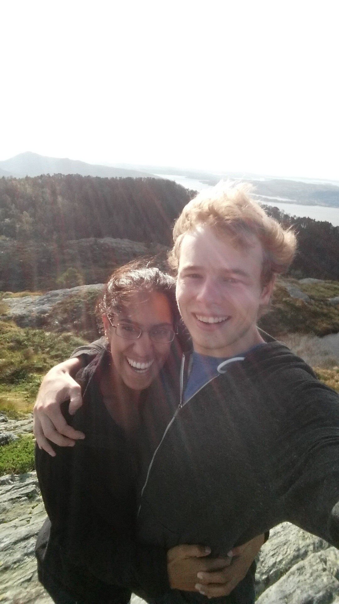

## What are we doing?

At the start of 2024, we left our jobs and decided to take a year off to go and explore the world. We both love to travel and for a long time had tossed around the idea of taking a break from work (a tough thing given that we both love our jobs!) and spend some dedicated time to travel.

After the pandemic derailed our plans to start earlier, we finally managed to find good stopping points and knighted 2024 our “year of travel.” So we’re off! We moved out of our apartment in Toronto, selling/donating most of our belongings and keeping the rest in storage. We’re not entirely sure where the year will take us but are super excited for all the adventures to come!

We’ll be keeping up this blog as way to capture our adventures throughout the year and as a record for us to be able to visit later down the line as well! If you’d like to be notified whenever we publish something new, there’s a subscribe button below! We’d love to meet people throughout the year so we’ll be publishing our roadmap on the Roadmap page (though be warned, it will be highly subject to change!).

\>

Us two crazy kids in Norway!
